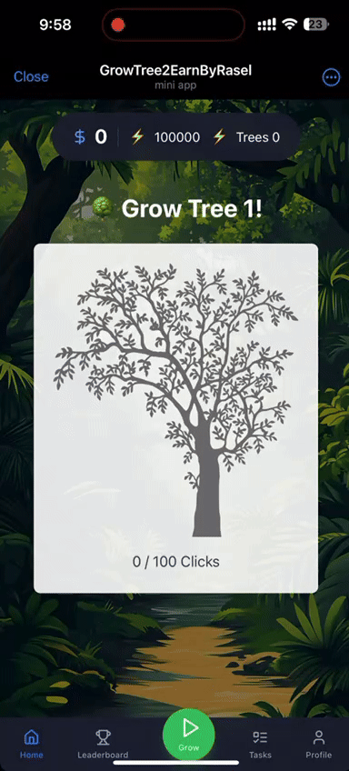

# 🌳 Tree Growing Click Game

A simple yet addictive tree-growing game built with React, TypeScript, and Vite. Perfect for learning how to create Telegram Mini Apps or starting your own project!

## 🎲 Try the Game

- 🔥 **Live Demo**: [Play on Telegram](https://t.me/GrowTree2Earnbot?profile)
- 🎮 **Quick Demo**:

<p align="center">
  
</p>

> Try growing your own virtual forest in our Telegram Mini App! Click the demo link above to start playing.

[Rest of your existing README content...]
## ⭐ Features in Action
- 🌱 Watch your tree grow with each click
- ⚡ Manage your energy wisely
- 🎯 Complete trees to unlock new ones
- 📱 Smooth mobile experience

## 🎮 Game Features

- Click-based tree growing mechanics
- Energy management system
- Progress tracking
- Beautiful tree visualization
- Responsive design for mobile and desktop
- Achievement system for completed trees
- Clean and modern UI with animated elements

## 🛠️ Technologies Used

- React.js
- TypeScript
- Vite
- Tailwind CSS
- Lucide React Icons

## 🚀 Getting Started

### Prerequisites

- Node.js (v14 or higher)
- npm or yarn

### Installation

1. Clone the repository
```bash
git clone https://github.com/rasel-gen/simple-tap-to-earn-telegram-mini-app-starter.git
```

2. Navigate to the project directory
```bash
cd simple-tap-to-earn-telegram-mini-app-starter
```

3. Install dependencies
```bash
npm install
# or
yarn install
```

### Environment Setup

Create `.env` file in the root directory:
```env
# The URL where your game is hosted
VITE_GAME_URL=https://your-game-url.com

# Your Telegram bot username (without @ symbol)
VITE_BOT_USERNAME=YourBotUsername

# Your Telegram bot token from BotFather
VITE_BOT_TOKEN=your_bot_token_here
```

### Development

```bash
# Start development server
npm run dev

# Build for production
npm run build

# Preview production build
npm run preview
```

## 📱 Adding Web App to Telegram (Quick Setup)

1. Open [BotFather](https://t.me/BotFather)
2. Write command `/newBot`. Give name and username to your bot
3. Type command `/mybots`. Click on your new created bot -> Bot Settings -> Menu Button
4. Send your deployed web app URL
That's it! Now you have your own Telegram bot with Mini App.

## 🎯 How to Play

1. Click the "Grow" button to nurture your tree
2. Each click:
   - Increases tree growth
   - Consumes energy
   - Earns points
3. Trees require different amounts of clicks to fully grow
4. Complete trees to unlock new ones
5. Manage your energy wisely

## 🔧 Game Mechanics

- Initial energy: 100,000 units
- Each click consumes 1 energy unit
- Each click earns 10 points
- Trees change color as they grow
- New trees require more clicks to complete

## 👨‍💻 About the Developer

Hi! I'm ProRasel, a passionate developer focused on creating engaging and interactive experiences. I specialize in:
- Telegram Bot Development
- Web Applications
- Mini Apps
- Full-stack Development
- UI/UX Design

### 🤝 Let's Work Together!

Looking to create your own:
- Telegram Bot?
- Mini App?
- Web Application?
- Custom Software Solution?

I'm available for freelance projects and collaborations. Let's turn your ideas into reality!

### 📞 Contact Me

- Email: azamanrsl@gmail.com
- Telegram: [ProRasel](https://t.me/ProRasel)
- Portfolio: [Your Portfolio URL]
- GitHub: [rasel-gen](https://github.com/rasel-gen)

## 🤝 Contributing

Contributions are welcome! Feel free to:

1. Fork the repository
2. Create a new branch (`git checkout -b feature/improvement`)
3. Make your changes
4. Submit a Pull Request

## 🐛 Found a Bug?

If you find any issues or have suggestions:
1. Open an issue on GitHub
2. Include steps to reproduce
3. Share any relevant screenshots

## 📄 License

This project is open source and available under the [MIT License](LICENSE).

## 🔧 Configuration Files

The project includes:
- `vite.config.ts` - Vite configuration
- `tsconfig.json` - TypeScript configuration
- `postcss.config.js` - PostCSS configuration
- `tailwind.config.js` - Tailwind CSS configuration
- `.eslintrc.cjs` - ESLint configuration

---

### 🌟 Need Custom Development?

I offer professional development services for:
- Custom Telegram Bots
- Mini Apps Development
- Web Application Development
- API Integration
- UI/UX Design

Contact me for a free consultation and let's discuss how I can help bring your project to life!

---

Made with ❤️ by [ProRasel](https://t.me/ProRasel)

Feel free to fork and modify the game for your own projects!